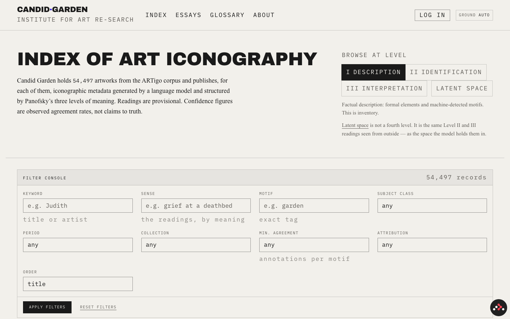
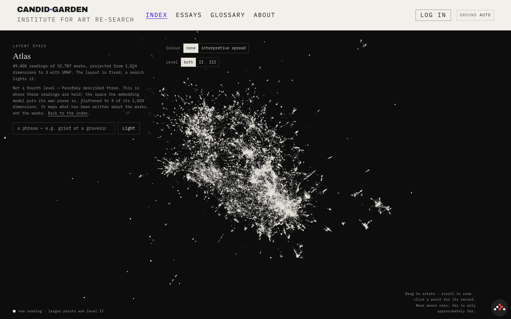
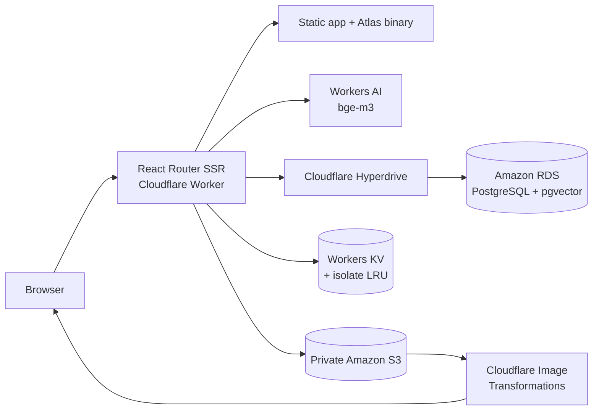

# Candid Garden

**An institute for art re-search: 54,497 artworks, machine-generated readings,
and an interface built to keep interpretation open to correction.**

[Live archive](https://candidgarden.com) ·
[Explore the Atlas](https://candidgarden.com/archive/atlas) ·
[Technical documentation](./docs/README.md)

Candid Garden is a research platform for asking how machines describe and
interpret art. It publishes iconographic metadata for works in the ARTigo
corpus, organises each reading through Erwin Panofsky's three levels of meaning,
and presents the results as provisional material for scholarly review—not as
machine truth.

[](https://candidgarden.com)

## What the project does

- **Makes a large corpus legible.** Browse 54,497 artworks by title, artist,
  motif, subject class, period, collection, attribution, agreement, or Panofsky
  level.
- **Searches by meaning.** Queries are embedded with `bge-m3` and ranked against
  1,024-dimensional interpretation vectors in PostgreSQL with pgvector. 
  
- **Keeps uncertainty visible.** Generated readings are labelled provisional;
  confidence represents observed agreement rather than truth, and authenticated
  researchers can review the underlying records.
- **Turns the corpus into a spatial argument.** The Atlas projects the reading
  corpus into a stable three-dimensional UMAP layout so a search becomes a
  constellation rather than another reordered list.
- **Treats the archive as the product.** The index is the homepage. There is no
  marketing page between the visitor and the research material.

## The Atlas

[](https://candidgarden.com/archive/atlas)

The [`/archive/atlas`](https://candidgarden.com/archive/atlas) route renders
**89,800 Level II and III readings from 52,787 works** as one interactive WebGL
point cloud. It maps the language written about the artworks—not the images
themselves.

The layout is fitted offline and remains fixed. Searching does not recompute or
rearrange the projection; it lights up to 900 matching readings within the same
space. That stability is the point: one search can form a tight cluster while
another splits into several regions, and both remain comparable because the map
has not moved.

Some of the less visible engineering behind the view:

- UMAP reduces 1,024-dimensional `bge-m3` embeddings to three dimensions with
  cosine distance and a reproducible seed.
- A custom, versioned binary format ships all geometry and identifiers in about
  **1.6 MB**, compared with roughly 8 MB as JSON.
- One `THREE.Points` object and a custom GPU shader control colour, size,
  filtering, and query highlighting without rebuilding the geometry.
- Artwork labels are fetched only when a point is hovered and cached for the
  session, avoiding a multi-megabyte title payload.
- “Interpretive spread”—the distance between a work's Level II and Level III
  readings—is measured in the original embedding space, not the lossy UMAP
  projection.

The complete data pipeline, binary layout, rendering decisions, and known gaps
are documented in [The Atlas](./docs/atlas.md).

## Architecture



Production runs as a server-rendered React Router application on Cloudflare
Workers. Hyperdrive connects request-local Prisma clients to Amazon RDS; Workers
AI embeds semantic queries; private S3 holds uploaded originals; and Cloudflare
transforms and caches images at the edge. A Node/Express runtime is kept as the
local-development and Playwright harness.

| Area                  | Technology                                                               |
| --------------------- | ------------------------------------------------------------------------ |
| Application           | React 19, React Router 7, TypeScript, Tailwind CSS                       |
| Data                  | PostgreSQL 17, Prisma, pgvector, Amazon RDS                              |
| Search and projection | Workers AI `bge-m3`, IVFFlat cosine search, UMAP                         |
| Visualisation         | three.js, WebGL, custom shaders, compact binary assets                   |
| Infrastructure        | Cloudflare Workers, Hyperdrive, KV, Image Transformations, Amazon S3     |
| Reliability           | Vitest, Testing Library, Playwright, MSW, ESLint, Sentry, GitHub Actions |

## Testing and delivery

The test strategy exercises both application behaviour and the two target
runtimes:

- **Vitest and Testing Library** cover authentication, security headers, error
  handling, UI utilities, and route behaviour. Parallel workers receive isolated
  PostgreSQL schemas, while MSW keeps third-party calls deterministic and
  offline.
- **Playwright** covers onboarding, profile management, two-factor
  authentication, passkeys, and error boundaries through the browser.
- **Static checks** include ESLint, generated React Router and Cloudflare types,
  and strict TypeScript checking.
- **CI builds both runtimes**—the Node test harness and the Cloudflare
  Worker—then gates deployment on linting, type checking, Vitest coverage, and
  Playwright.

Run the complete local validation pipeline with:

```sh
npm run validate
```

Individual commands are available when iterating:

```sh
npm run test -- --run   # unit and integration tests
npm run coverage        # Vitest with coverage
npm run test:e2e:run    # production-build browser tests
npm run typecheck       # generated types + TypeScript
npm run lint
```

## Tradeoffs and constraints

This project makes its compromises explicit because the interface can otherwise
make uncertain data look more authoritative than it is.

| Decision                                                       | Benefit                                                              | Cost                                                                                |
| -------------------------------------------------------------- | -------------------------------------------------------------------- | ----------------------------------------------------------------------------------- |
| Fit the Atlas offline and keep its coordinates fixed           | Searches remain comparable and request-time compute stays small      | The projection must be regenerated when the corpus or model changes                 |
| Use UMAP for the Atlas                                         | Preserves useful local neighbourhoods in an explorable view          | Global distances, cluster sizes, and gaps are not reliable measurements             |
| Ship custom binary geometry and load labels on demand          | Keeps 89,800 points to about 1.6 MB and avoids shipping every title  | Adds format-versioning code and a network request on first hover                    |
| Disable Hyperdrive query caching                               | Preserves authentication, mutation, and read-after-write correctness | Gives up a potential database-read optimisation                                     |
| Keep RDS private and run migrations separately from deployment | Avoids opening the database to generic hosted runners                | Makes migrations an explicit operational step before release                        |
| Render the Atlas in WebGL                                      | Makes a dense, interactive 89,800-point view practical               | The point cloud still lacks a complete non-WebGL and keyboard-accessible equivalent |

## Run locally

### Prerequisites

- Node.js 22.18 or newer
- Docker with Compose

### Setup

```sh
git clone https://github.com/osmancakir/candidgarden_web.git
cd candidgarden_web
npm ci
cp .env.example .env
npm run db:start
npx prisma migrate deploy
npx prisma generate
npx prisma db seed
npm run dev
```

The default development server uses MSW-backed third-party integrations, so it
does not need real email or S3 credentials. See
[Getting Started](./docs/getting-started.md) for the development workflow and
[Deployment](./docs/deployment.md) for the Cloudflare, RDS, and S3 production
setup.

## Documentation

- [Atlas pipeline and rendering](./docs/atlas.md)
- [Database and pgvector](./docs/database.md)
- [Amazon RDS setup](./docs/amazon-rds-postgresql.md)
- [Image storage](./docs/image-storage.md)
- [Deployment](./docs/deployment.md)
- [Security model](./docs/security.md)
- [Architecture decisions](./docs/decisions/README.md)

## Contact

[hey@candidgarden.com](mailto:hey@candidgarden.com)
